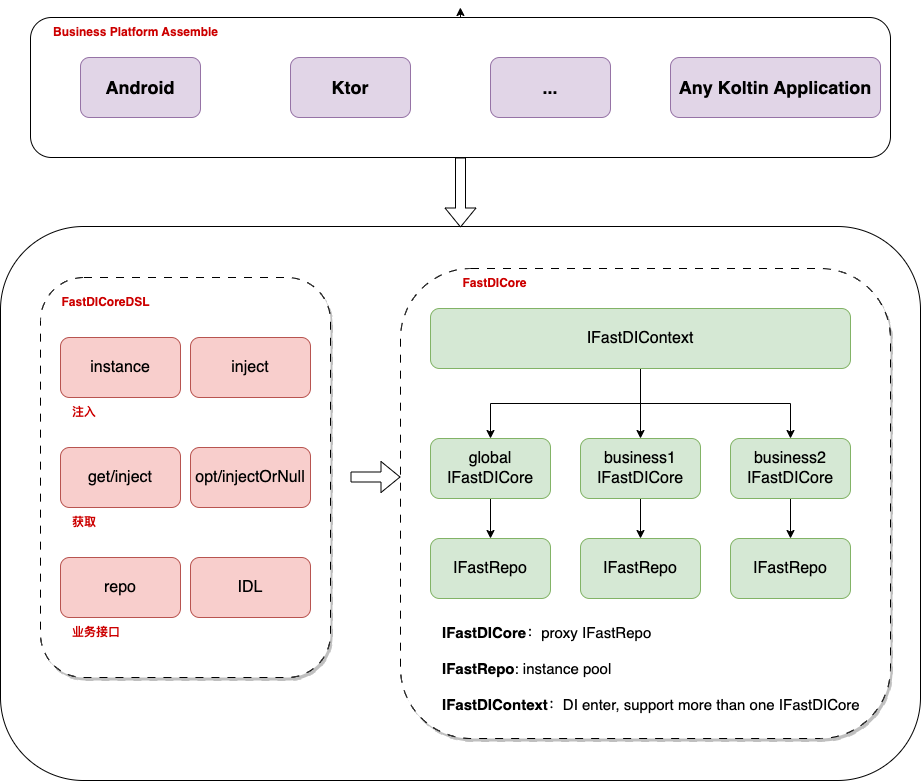

## 1. What is FastDI

- An Framework IOC/DI by kotlin
- Support Android or Kotlin
- Study Demo, not for productivity now


## 2. Framework




## 3. DSL && use

### 3.1 DSL

**`instance`:** register a instance to repo, create when get or opt

**`inject`**: register a instance to repo, support more than one class instance by name

**`get`**: get a instance from repo, will throw Exception when get null, use name if more than one instance

**`opt`**: opt a instance from repo, may be get null, use name if more than one instance

**`inject`**: get a instance from repo, for IDI

**`injectOrNull`**: opt a instance from repo, for IDI

### 3.2 Use

```kotlin
// 1. start inject
    DI.repo {
        instance { "new" }
        instance { "two" }
        instance { Book("Hello Ktor", 1.1f) }
        instance { House("instance", 1.1f) }
        inject("one") { House("one", 1.1f) }
        inject("two") { House("two", 1.1f) }
        inject("three") { House("three", 1.1f) }

    }
// 2. get instance by repo
    DI.repo {
        val valueNew = get<String>()
        println(valueNew)
        println(opt<Book>())
        println(opt<House>("one"))
        println(opt<House>())
        println(opt<House>("two"))
        println(opt<House>())
    }
    
// 3. get instance by IDL, every business can implement IDL
class ModuleA(override val diCore: IFastRepo) : IDI {

    private val book by inject<Book>()

    private val people by injectOrNull<People>()

    fun test() {
        println("-----module A------")
        println("book:$book")
        println("people:$people")
    }

}

class ModuleA(override val diCore: IFastRepo) : IDI {

    private val book by inject<Book>()

    private val people by injectOrNull<People>()

    fun test() {
        println("-----module A------")
        println("book:$book")
        println("people:$people")
    }
}

class ModuleB(override val diCore: IFastRepo) : IDI {

    private val moduleA by inject<ModuleA>()

    private val house by inject<House>()

    fun test() {
        println("---moduleB-----")
        println(house)
        moduleA.test()
    }
}
```


## 4. Update

`V1.0`：FastDICore is Completed, support instance、inject、get、opt、repo、IDL，every Kotlin Application can use it 